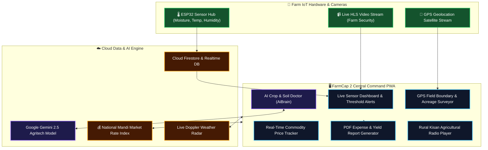

<div align="center">


# FARMCAP 2 — SMART AGRITECH & IOT ECOSYSTEM
### *AI-Powered Farm Intelligence • Real-Time IoT Telemetry • GPS Land Surveyor • Live CCTV*

[](https://react.dev)
[](https://vitejs.dev)
[](https://tailwindcss.com)
[](https://ai.google.dev)
[](https://firebase.google.com)
[](https://leafletjs.com)
[](LICENSE)

<br/>

<p align="center">
  <a href="#-system-architecture"><b>Architecture</b></a> •
  <a href="#-core-modules"><b>Core Modules</b></a> •
  <a href="#-iot-sensors--security"><b>IoT & Security</b></a> •
  <a href="#-quick-start"><b>Quick Start</b></a> •
  <a href="#-project-structure"><b>Structure</b></a>
</p>

---

</div>

## 📡 Overview
**FarmCap 2** is an all-in-one Smart Agriculture & IoT Management Platform engineered to modernize precision farming for rural agriculturists. 

By combining **ESP32 IoT sensor telemetry**, **Google Gemini AI agronomy advisory**, **sub-meter GPS perimeter land surveying**, **live HLS camera surveillance**, and **real-time Mandi market rates**, FarmCap 2 equips farmers with actionable data to maximize crop yields and cut operational expenditures.

---

## 🏗️ System Architecture


---

## 🧩 Core Innovation & Capabilities
<table>
  <tr>
    <td width="50%" valign="top">
      <h3>🌡️ IoT Sensor Dashboard & Alerts</h3>
      <ul>
        <li><b>Telemetry:</b> Real-time soil moisture percentage, ambient temperature, humidity levels, and irrigation valve state.</li>
        <li><b>Threshold Triggers:</b> Automated push notifications when soil dries below optimal moisture levels.</li>
        <li><b>Wiring Diagrams:</b> Interactive schematics and sensor pinout references for field deployment.</li>
      </ul>
    </td>
    <td width="50%" valign="top">
      <h3>🤖 Gemini Agronomy Doctor</h3>
      <ul>
        <li><b>Plant Pathology Analysis:</b> Instant diagnosis of leaf pests, fungi, and nutrient deficiencies.</li>
        <li><b>Localized Care Plans:</b> Organic and chemical treatment schedules tailored to regional climates.</li>
        <li><b>Offline Fallback:</b> IndexedDB caching guarantees access to essential guides without connectivity.</li>
      </ul>
    </td>
  </tr>
  <tr>
    <td width="50%" valign="top">
      <h3>🗺️ GPS Land & Acreage Surveyor</h3>
      <ul>
        <li><b>Polygon Field Mapping:</b> Walk your farm boundary to calculate exact acreage, hectares, and perimeter.</li>
        <li><b>High-Precision Polygon Rendering:</b> Powered by Leaflet Maps and Turf.js geometry calculations.</li>
        <li><b>Fence Planning:</b> Estimates required fencing wire and irrigation pipe lengths.</li>
      </ul>
    </td>
    <td width="50%" valign="top">
      <h3>Mandi Rates & Financial Reports</h3>
      <ul>
        <li><b>Live Market Index:</b> Real-time pricing for wheat, paddy, cotton, pulses, and vegetables across state mandis.</li>
        <li><b>Expense Ledger:</b> Track seed, fertilizer, fuel, and labor expenditures per crop cycle.</li>
        <li><b>1-Click PDF Export:</b> Generate balance sheets with <code>jspdf</code> and <code>html2canvas</code>.</li>
      </ul>
    </td>
  </tr>
</table>

---

## 🚀 Quick Start Guide
### ⚙️ Prerequisites
* **Node.js** `v18+` & **npm**

```bash
# 1. Clone the repository
git clone https://github.com/Tharun8994/FARM-CAP-2.git
cd FARM-CAP-2

# 2. Install dependencies
npm install

# 3. Start development server
npm run dev
```

Open **`http://localhost:5173`** in your browser to launch the farm dashboard!

---

## 📂 Repository Structure
```
FARM-CAP-2/
+-- public/                     # Static assets & PWA manifest
+-- src/
¦   +-- components/
¦   ¦   +-- BottomNav.jsx       # Mobile bottom navigation bar
¦   ¦   +-- ChatBot.jsx         # Gemini AI Farm Assistant interface
¦   ¦   +-- CropExpenses.jsx    # Crop expenditure ledger & balance sheet
¦   ¦   +-- FarmSecurityCard.jsx# Live HLS video surveillance viewer
¦   ¦   +-- GPSMeasurement.jsx  # GPS field boundary surveyor & acreage calculator
¦   ¦   +-- MarketRates.jsx     # State-wise Mandi market pricing board
¦   ¦   +-- Radio.jsx           # Agricultural Kisan radio player
¦   ¦   +-- SensorDashboard.jsx # Real-time IoT sensor telemetry & graphs
¦   ¦   +-- Weather.jsx         # ? Doppler weather forecasts & rain alerts
¦   +-- services/
¦   ¦   +-- AiBrain.js          # Gemini API integration & prompt engine
¦   ¦   +-- idb.js              # IndexedDB offline caching service
¦   ¦   +-- PushNotifications.js# Real-time browser push notifications
¦   +-- firebase.js             # Cloud Firestore initialization
¦   +-- App.jsx                 # Root component & state management
¦   +-- index.css               # Tailwind CSS v4 design tokens
+-- index.html
+-- package.json
+-- vite.config.js
```

---

---

<div align="center">
  <sub>Precision agritech IoT sensor telemetry & AI agronomy advisory. MIT Licensed.</sub>
</div>
